```{r setup, include=FALSE}
knitr::opts_chunk$set(echo = FALSE)
knitr::opts_chunk$set(message=FALSE, warning=FALSE)
options(max.print=30)
```

## 1. Abstract

A partir de un contaje de tránscritos de diferentes muestras se ha realizado un análisis RNAseq con el objetivo de encontrar tránscritos diferencialmente expresados entre tres tipos de infiltración de tiroides. Los resultados obtenidos indican que de tres comparaciones realizadas, únicamente 2 presentan una gran cantidad de tránscritos con expresión diferencial. Parece ser que parte de los tránscritos de ambos grupos forman parte de las mismas vías celulares como son las de linaje de células hematopoyéticas o de red inmune intestinal.  

## 2. Objetivo

El objetivo de este trabajo es llevar a cabo un análisis RNAseq para encontrar tránscritos diferencialmente expresados entre tres tipos de infiltración de tiroides: tejidos no infiltrados (NIT), infiltraciones focales (SFI) e infiltraciones linfoides (ELI).

## 3. Materiales y métodos

Todo el contenido de este análisis, así como los resultados obtenidos y los datos utilizados pueden encontrarse en el siguiente directorio de [GitHub](https://github.com/olrema/Analisis_RNAseq). No obstante, solo se encuentran los datos ya preparados con las 30 muestras para el análisis, puesto que los archivos de datos originales superan el tamaño para poder subirlos al repositorio. 

### 3.3. Datos

Los datos de estudio corresponden a un análisis de tiroides en el que se compara la expresión de tres tipos de infiltración. Se dispondrá de 30 muestras divididas en 3 grupos según el tipo de infiltración:

- Tejidos no infiltrados (NIT).
- Infiltraciones focales pequeñas (SFI).
- Infiltraciones linfoides extensas (ELI).

Cada grupo contendrá 10 muestras extraidas de datos originales provinientes del repositorio GTEx. 

### 3.2. Etapas del análisis

El análisis se ha llevado acabo siguiendo las etapas descritas en la Figura 1. 

El procesado de datos ha consistido en la realización de un filtraje, una normalización y un control de calidad de los mismos 

<center>

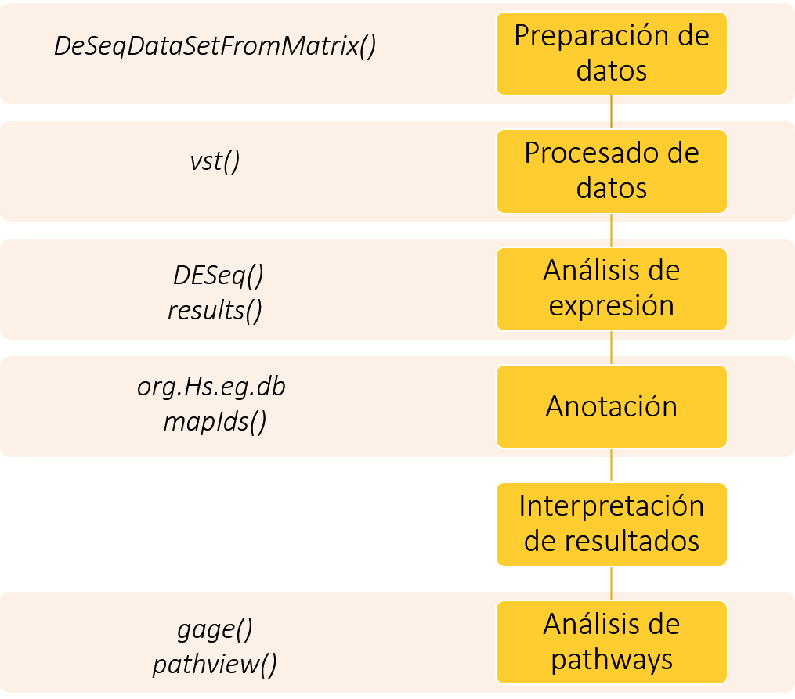{width=40%}

</center>

### 3.3. Métodos de análisis

Una modificación previa de los datos ha sido necesaria para adaptarlos a las funciones del programa y para poder realizar el análisis de forma óptima. 

Los contajes que no disponían de información relevante se han filtrado y se han normalizado los datos para estabilizar las varianzas. 

Posteriormente se ha realizado un análisis exploratorio para valorar el conjunto de datos que va a ser analizado. Para ello se ha optado por representar los datos de varias maneras: boxplot, heatmap de distancias, PCA, MA (2, 3).

El análisis de expresión completo se ha llevado a cabo utilizando funciones del paquete 'DESeq' (1). Primero, para cada comparación, se ha realizado una búsqueda de los tránscritos diferencialmente expresados en nuestras muestras seleccionadas, valorando si eran up-regulados o down-regulados. Para hacerlo, se han considerado significativos aquellos resultados con un p-valor inferior a 0.05. Seguidamente se han anotado los tránscritos utilizando el paquete de anotaciones 'org.Hs.eg.db'. 

Para interpretar los resultados obtenidos se han representado los tránscritos representativos en gráficos MA, de contaje y heatmap. 

Por último se ha realizado un análisis de pathways con el objetivo de evaluar en qué vías celulares están involucrados los genes de los que provienen nuestros tránscritos. Para hacerlo teníamos varias opciones como ClusterProfiler o ReactomePA, pero al final nos hemos decantado por 'gage' y 'gageData', utilizando los datos de anotaciones almacenados en las bases de datos de KEGG (4), debido a su simplicidad de uso. Este proceso no es concluyente debido a que muchos de los tránscritos no han sido detectados y anotados correctamente, pero nos ayuda a tener una idea de qué vías pueden verse afectadas con aquellos tránscritos que sí han sido detectados. Es muy probable, por tanto, que haya otras vías más afectadas que no se estarán teniendo en cuenta. 

En la figura 1 se indica las funciones más importantes que se han aplicado para realizar los pasos del pipeline descrito. 

#### 3.3.1. Herramientas y procedimientos bioinformáticos de análisis

Los análisis estadísticos se han realizado utilizando el lenguaje R. La mayoría de las funciones utilizadas proceden del paquete Bioconductor. A continuación se muestra una lista de las librerías que se han utilizado durante el análisis de expresión:

```{r, echo=T, eval=F}
library(dplyr)
library(stringr)
library(DESeq2)
library(ggplot2)
library(AnnotationDbi)
library(org.Hs.eg.db)
library(pheatmap)
library(pathview)
library(gage)
library(gageData)
```

## 4. Prepraración de los datos

Para poner a punto los datos con los que vamos a trabajar seleccionamos aleatoriamente 10 muestras de cada grupo de los archivos de origen. Para ello, corregimos el archivo *all_targets.csv* mediante excel, de forma que nos separe adecuadamente las columnas y seguidamente, cambiamos los nombres de las muestras (Sample_Name) para que coincidan con los del archivo *all_counts.csv*. Con este objetivo, se sustituyen los guiones por puntos. 

Una vez tenemos listo el archivo *all_targets*, lo abrimos con R y seleccionamos aleatoriamente las 10 muestras de cada grupo. Por último extraemos los datos contenidos en el archivo *all_counts* para cada muestra seleccionada. Es importante que al generar las dos nuevas tablas el nombre de las columnas de counts sea igual al nombre de las filas de targets. 

Por último, modificamos el nombre de los tránscritos eliminando su versión de Ensembl para que sean reconocidos al realizar la anotación.

```{r}
# Lectura de datos. 
workingDir <- getwd()
dataDir <- file.path(workingDir,"data")
resultsDir <- file.path(workingDir, "results")

all_targets <- read.csv(file.path(dataDir, "all_targets.csv"),sep=';')
all_counts <- read.csv(file.path(dataDir, "all_counts.csv"),sep=';',header=T)
```
```{r, echo=T}
# Selección aleatoria de las muestras.
set.seed(22)
total_NIT<-subset(all_targets, all_targets$Group=="NIT")
NIT<-total_NIT[sample(nrow(total_NIT), 10),] 
total_SFI<-subset(all_targets, all_targets$Group=="SFI")
SFI<-total_SFI[sample(nrow(total_SFI), 10),]
total_ELI<-subset(all_targets, all_targets$Group=="ELI")
ELI<-total_ELI[sample(nrow(total_ELI), 10),]

# Extracción de los datos para cada muestra seleccionada. 
library(dplyr)
counts_NIT<-all_counts%>%select(X, NIT$Sample_Name)
counts_SFI<-all_counts%>%select(X, SFI$Sample_Name)
counts_ELI<-all_counts%>%select(X, ELI$Sample_Name)
counts<-data.frame(counts_NIT,counts_SFI[2:11],counts_ELI[2:11])

# Eliminación de la versión de los tránscritos.
library(stringr)
counts$X <- gsub("\\..*", "", counts$X, fixed = FALSE)
```

Como resultado obtenemos dos tablas finales con las que vamos a trabajar: *targets.csv* y *counts.csv*. Las guardamos como *.csv* y volvemos a abrirlas con R, guardándolas en las variables *counts* y *targets*, especificando que *counts* sea leída como matriz. 

```{r, eval=F, echo=T}
# Guardado de archivos definitivos
write.table(NIT[1:9], "./results/targets.csv", sep = ";",row.names = NIT$Sample_Name )
write.table(SFI[1:9], "./results/targets.csv", sep = ";",col.names =F,row.names = SFI$Sample_Name, append = T)
write.table(ELI[1:9], "./results/targets.csv", sep = ";", col.names =F,row.names = ELI$Sample_Name,append = T)

write.table(counts[2:31],"./results/counts.csv", sep = ";",row.names=counts$X)
```
```{r, echo=T}
# Lectura de los dos nuevos archivos
targets <- (read.csv(file.path(resultsDir, "targets.csv"),sep=';'))
counts <- as.matrix(read.csv(file.path(resultsDir, "counts.csv"),sep=';'))
```

```{r, include=T, echo=T}
head(targets,3)
head(counts,3)
```

A partir de la matriz de contajes y la tabla con información de las muestras, generamos el objeto DESeqDataSet:

```{r}
library("DESeq2")
dds <- DESeqDataSetFromMatrix(countData = counts,
colData = targets, design = ~ Group)
dds
```

## 5. Procesado de datos 

### 5.1. Filtraje

Antes de empezar con el análisis exploratorio de los datos, realizamos un primer filtraje en el que se eliminen las filas que no contengan información relevante para el análisis. De esta forma pasamos de disponer 56202 filas a 43333.

```{r, include=F}
nrow(dds)
dds<-dds[rowSums(counts(dds))>1,]
nrow(dds)
```

### 5.2. Normalización

Con el objetivo de que el análisis exploratorio funcione de forma óptima, transformamos los datos del contaje normalizándolos mediante la estabilización de la varianza. 

```{r}
vsd<- vst(dds)
head(assay(vsd),3)
```

### 5.3. Análisis exploratorio

Para hacernos una idea de la distribución de las muestras creamos un boxplot representado en la figura 2, donde los colores que aparecen corresponden a los grupos de muestras "INT","SFI" y "ELI" respectivamente. 

<center>

```{r, fig.cap="Figura 2. Boxplot con la distribución de las muestras."}
library(ggplot2)
boxplot(assay(vsd), las=2, col=c(rep("lightsalmon",10),rep("orchid3",10),rep("lightblue",10)))
```

</center>

Para valorar la distancia entre las muestras, primero calculamos la matriz de distancias y luego la representamos gráficamente (figura 3) para tener una idea más visual. 

<center>

```{r, fig.cap="Figura 3. Heatmap con las distancias entre las muestras."}
sampleDists <- dist(t(assay(vsd)))
library("pheatmap")
sampleDistMatriz <- as.matrix(sampleDists)
rownames (sampleDistMatriz) <- paste(vsd$Group,vsd$ShortName,sep=" - ")
colnames (sampleDistMatriz) <- NULL
pheatmap(sampleDistMatriz,
         clusternig_distance_rows=sampleDists,
         clusternig_distance_cols=sampleDists)
```

</center>

Para describir el conjunto de datos según las variables que tenemos, vamos a realizar un gráfico PCA (figura 4).

<center>

```{r, fig.cap="Figura 4. Gráfico PCA de las muestras."}
plotPCA(vsd,intgroup=c("Group","ShortName"))
```

</center>

Con el gráfico MA representado en la figura 5, podemos observar la relación de los datos entre los diferentes grupos definidos. 

<center>

```{r, fig.cap="Figura 5. Gráficos MA de las comparaciones por grupos de las muestras."}
x<- assay(vsd[,1:10])
y <- assay(vsd[,11:20])
z <- assay (vsd[,21:30])
par(mfrow=c(1,3))
limma::plotMA(x,y, main="NIT vs SFI")
limma::plotMA(z,x, main="NIT vs ELI")
limma::plotMA(y,z, main="SFI vs ELI")
```

</center>

## 6. Análisis de expresión diferencial y anotación

```{r, echo=T}
dds <- DESeq(dds,parallel = TRUE)
```

En los siguientes apartados se realiza el análisis de expresión diferencial de los 43331 tránscritos para cada comparación. Se consideran significativos aquellos resultados con un p-valor inferior a 0.05.

Únicamente se muestra el código utilizado para la primera comparación, pero es equivalente para las dos restantes. 

### 6.1. Grupo NIT vs SFI

En esta primera comparación, únicamente se encuentra 1 tránscrito expresado diferencialmente, el cual parece estar up-regulado. Sus parámetros y su anotación se muestran en la tabla 1. 

```{r, echo=T}
# Primera comparación 
res_NIT_SFI <- results(dds,contrast=c("Group","NIT","SFI"), alpha=0.05)
summary(res_NIT_SFI)
resSig_1 <- subset(res_NIT_SFI, padj < 0.05)

# Anotación
library("AnnotationDbi")
library(org.Hs.eg.db)
resSig_1$symbol <- mapIds(org.Hs.eg.db,
                     keys=row.names(resSig_1),
                     column="SYMBOL",
                     keytype="ENSEMBL",
                     multiVals="first")
resSig_1$entrez <- mapIds(org.Hs.eg.db,
                     keys=row.names(resSig_1),
                     column="ENTREZID",
                     keytype="ENSEMBL",
                     multiVals="first")

# Tabla con los genes más significativamente expresados
knitr::kable(head(resSig_1[order(resSig_1$log2FoldChange,decreasing = TRUE), ]),caption="Tabla 1. Gen up-regulado en la comparación NIT vs SFI.")

```


### 6.2. Grupo NIT vs ELI

Como vemos en el resumen del análisis para esta segunda comparación, se han encontrado un total de 373 tránscritos up-regulados (mostrados en la tabla 2) y 1722 down-regulados (en la tabla 3).

```{r}
res_NIT_ELI <- results(dds,contrast=c("Group","NIT","ELI"), alpha=0.05)
summary(res_NIT_ELI)

resSig_2<- subset(res_NIT_ELI, padj < 0.05)

resSig_2$symbol <- mapIds(org.Hs.eg.db,
                     keys=row.names(resSig_2),
                     column="SYMBOL",
                     keytype="ENSEMBL",
                     multiVals="first")
resSig_2$entrez <- mapIds(org.Hs.eg.db,
                     keys=row.names(resSig_2),
                     column="ENTREZID",
                     keytype="ENSEMBL",
                     multiVals="first")


knitr::kable(head(resSig_2[order(resSig_2$log2FoldChange,decreasing = TRUE), ]),caption="Tabla 2. Genes up-regulados en la comparación NIT vs ELI.")
knitr::kable(head(resSig_2[order(resSig_2$log2FoldChange), ]),caption="Tabla 3. Genes down-regulados en la comparación NIT vs ELI.")
```

### 6.3. Grupo SFI vs ELI

Por úlitmo, al comparar los tránscritos del grupo SFI con los del grupo ELI, obtenemos 1207 up-regulados (tabla 4) y 205 down-regulados (tabla 5).

```{r}
res_ELI_SFI <- results(dds,contrast=c("Group","ELI","SFI"), alpha=0.05)
summary(res_ELI_SFI)

resSig_3 <- subset(res_ELI_SFI, padj < 0.05)

resSig_3$symbol <- mapIds(org.Hs.eg.db,
                     keys=row.names(resSig_3),
                     column="SYMBOL",
                     keytype="ENSEMBL",
                     multiVals="first")
resSig_3$entrez <- mapIds(org.Hs.eg.db,
                     keys=row.names(resSig_3),
                     column="ENTREZID",
                     keytype="ENSEMBL",
                     multiVals="first")


knitr::kable(head(resSig_3[order(resSig_3$log2FoldChange,decreasing = TRUE), ]),caption="Tabla 4. Genes up-regulados en la comparación SFI vs ELI.")
knitr::kable(head(resSig_3[order(resSig_3$log2FoldChange), ]),caption="Tabla 5. Genes down-regulados en la comparación SFI vs ELI.")
```

```{r, eval=F}
# Guardado de tablas
write.table(as.data.frame(resSig_1), "./results/NITvsSFI.csv", sep = ";")
write.table(as.data.frame(resSig_2), "./results/NITvsELI.csv", sep = ";")
write.table(as.data.frame(resSig_3), "./results/SFIvsELI.csv", sep = ";")
```

## 7. Interpretación de resultados

Según los resultados que hemos obtenido, a simple vista los grupos NIT y SFI no muestran diferencias en la expresión transcripcional, mientras que cuando se comparan con el grupo ELI, la expresión sí varía. Esto parece indicar que las condiciones del grupo ELI alteran la expresión génica normal de las muestras. Vamos a comprobar esto mediante representaciónes gráficas de los resultados obtenidos. 

En las figuras 6, 7 y 8 se representan los resultados de los tránscritos expresados diferencialmente para las 3 comparaciones en forma de gráficos MA. Los puntos rojos indican los tránscritos que tienen un p-valor inferior a 0.05. Los triángulos representan los tránscritos que más se expresan de forma diferencial, ya sea en forma de down-regulated o up-regulated. 

```{r, fig.cap="Figura 6. Gráfico MA para NIT vs SFI."}
DESeq2::plotMA(res_NIT_SFI, main = "NITvsSFI", ylim=c(-3,3))
```

```{r, fig.cap="Figura 7. Gráfico MA para NIT vs ELI."}
DESeq2::plotMA(res_NIT_ELI, main = "NITvsELI")

```

```{r, fig.cap="Figura 8. Gráfico MA para SFI vs ELI."}
DESeq2::plotMA(res_ELI_SFI, main = "SFIvsELI")
```

En la figura siguiente (figura 9) se muestran los contajes en cada grupo para el gen con menor p-valor de cada comparación. Se puede observar que en la primera comparación, el tránscrito con menor p-valor tiene un contaje parecido en los 3 grupos, excepto en una muestra del grupo NIT, donde se encuentra en mayor proporcion que en el resto. Respecto a las otras dos comparaciones también podemos comprobar como el contaje de los dos tránscritos se ve aumentado en el grupo ELI respecto al resto.

```{r, fig.cap="Figura 9. Contaje de los genes con el menor p-valor de cada comparación en cada grupo."}
par(mfrow=c(1,3))
plotCounts(dds, gene=which.min(res_NIT_SFI$padj), intgroup="Group")
plotCounts(dds, gene=which.min(res_NIT_ELI$padj), intgroup="Group")
plotCounts(dds, gene=which.min(res_ELI_SFI$padj), intgroup="Group")
```

En el heatmap de la figura 10 se observa la relación de gran cantidad de información. Por una parte, podemos ver los 20 tránscritos con mayor varianza (filas) junto a qué muestra pertenecen (columnas). A su misma vez, en la parte superior, se agrupa esta información según el grupo al que pertenece cada muestra y además, según el sexo del paciente analizado. Curiosamente se observa como existe una expresión diferencial según el sexo, ya que hay tránscritos que se expresan solo en uno de ellos. 

```{r, fig.cap="Figura 10. Heatmap con los 20 tránscritos más representativos, junto con las muestras a las que pertenecen, y agrupados por grupo y sexo."}
topVarGenes <- head(order(rowVars(assay(vsd)), decreasing = TRUE), 20)

mat  <- assay(vsd)[topVarGenes, ]
mat  <- mat - rowMeans(mat)
anno <- as.data.frame(colData(vsd)[,c("Group","sex")])
pheatmap(mat, annotation_col = anno)
```

## 8. Análisis de pathways

A continuación y para finalizar el análisis, vamos a proceder a realizar un análisis de pathways a partir de las bases de datos de KEGG. Vamos a comprobar qué vías se ven afectadas a causa de la sobreexpresión o baja expresión de los tránscritos según las comparaciones estudiadas. 

Este procedimiento solo tendrá en cuenta aquellos tránscritos que se han identificado con algún gen en la anterior anotación. Por este motivo, los resultados que se obtengan a partir de este análisis de pathways son únicamente orientativos para hacernos una idea de las vías que se están viendo afectadas, pero no significa que sean las únicas, ya que puede haber otras que estén afectadas en mayor medida pero no se estén teniendo en cuenta porque no se han identificado correctamente los tránscritos. 

El análisis solo se lleva a cabo para las comparaciones donde se han obtenido resultados concluyentes, es decir para NIT vs ELI y SFI vs ELI. 

Los resultados obtenidos se ven reflejados en las tablas siguientes, donde se muestran las principales vías tanto up como down-regulated para las dos comparaciones. Si nos fijamos en los resultados, curiosamente, las mismas vías que se ven down-reguladas en NIT vs ELI, se ven up-reguladas en SFI vs ELI. Sin embargo, de forma contraria solo coinciden en un par de vías. Este es un dato importante si tenemos en cuenta que la mayoría de tránscritos expresados diferencialmente en la comparación NIT vs ELI son down-regulados, mientras en SFI vs ELI son up-regulados. El hecho de que ambas comparaciones coincidan en la expresión contraria de los tránscritos y por consiguiente, en las vías, es un dato importante que hay que tener en cuenta. En las figuras 11-20, se representan los diagramas para estas 5 vías principales coincidentes en las dos comparaciones. 

**NIT vs ELI**

```{r, echo=T}
library(pathview)
library(gage)
library(gageData)
data(kegg.sets.hs)
data(sigmet.idx.hs)
kegg.sets.hs = kegg.sets.hs[sigmet.idx.hs]

#NIT vs ELI
selected_NIT_ELI<-subset(resSig_2, resSig_2$entrez!="NA")
foldchanges = selected_NIT_ELI$log2FoldChange
names(foldchanges) = selected_NIT_ELI$entrez
keggres = gage(foldchanges, gsets=kegg.sets.hs, same.dir=TRUE)

lapply(keggres, head)
```
```{r, echo=T, eval=F}
# Filtraje 
keggrespathways = data.frame(id=rownames(keggres$less), keggres$less) %>% 
  tbl_df() %>% 
  filter(row_number()<=5) %>% 
  .$id %>% 
  as.character()
keggresids = substr(keggrespathways, start=1, stop=8)

# Creación pathways
setwd(resultsDir)
dir.create("NITvsELI")
setwd('./NITvsELI')
tmp = sapply(keggresids, function(pid) pathview(gene.data=foldchanges, pathway.id=pid, species="hsa"))
setwd(workingDir)
```

**SFI vs ELI**

```{r}
selected_SFI_ELI<-subset(resSig_3, resSig_3$entrez!="NA")
foldchanges = selected_SFI_ELI$log2FoldChange
names(foldchanges) = selected_SFI_ELI$entrez
keggres = gage(foldchanges, gsets=kegg.sets.hs, same.dir=TRUE)

lapply(keggres, head)
```
```{r, eval=F}
# Filtraje 
keggrespathways = data.frame(id=rownames(keggres$greater), keggres$greater) %>% 
  tbl_df() %>% 
  filter(row_number()<=5) %>% 
  .$id %>% 
  as.character()
keggresids = substr(keggrespathways, start=1, stop=8)

# Creación pathways
setwd(resultsDir)
dir.create("SFIvsELI")
setwd('./SFIvsELI')
tmp = sapply(keggresids, function(pid) pathview(gene.data=foldchanges, pathway.id=pid, species="hsa"))
setwd(workingDir)
```

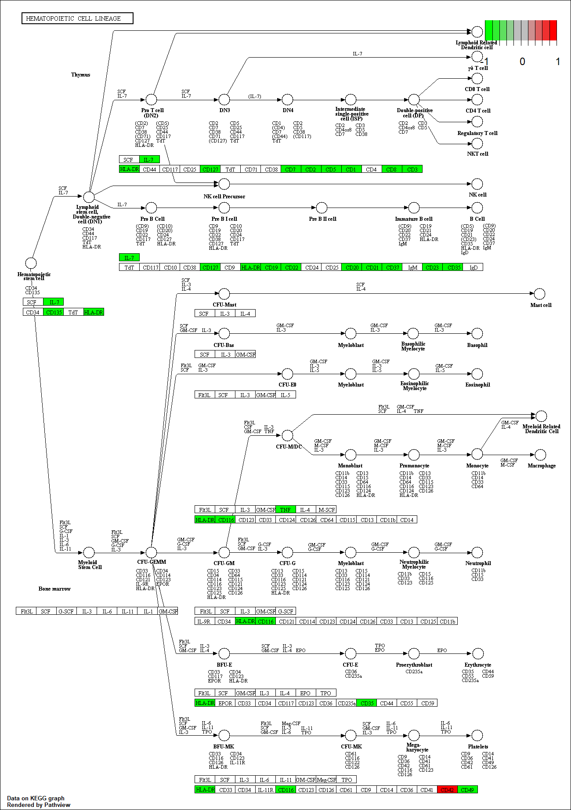

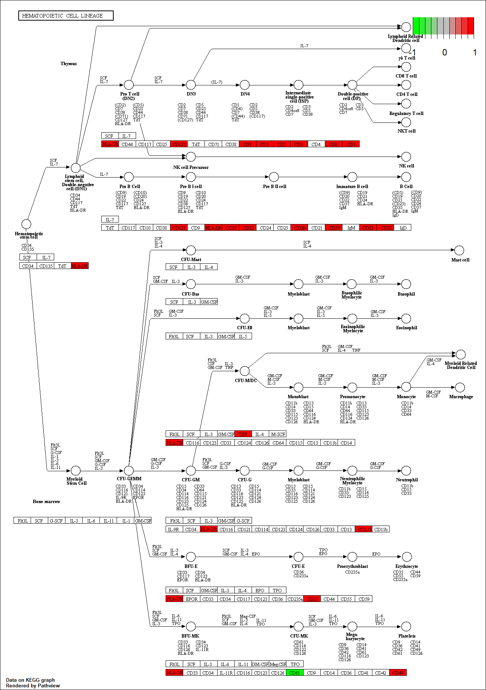

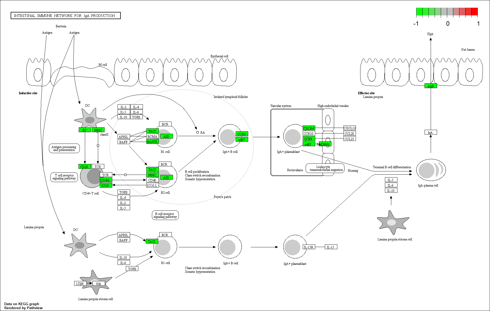

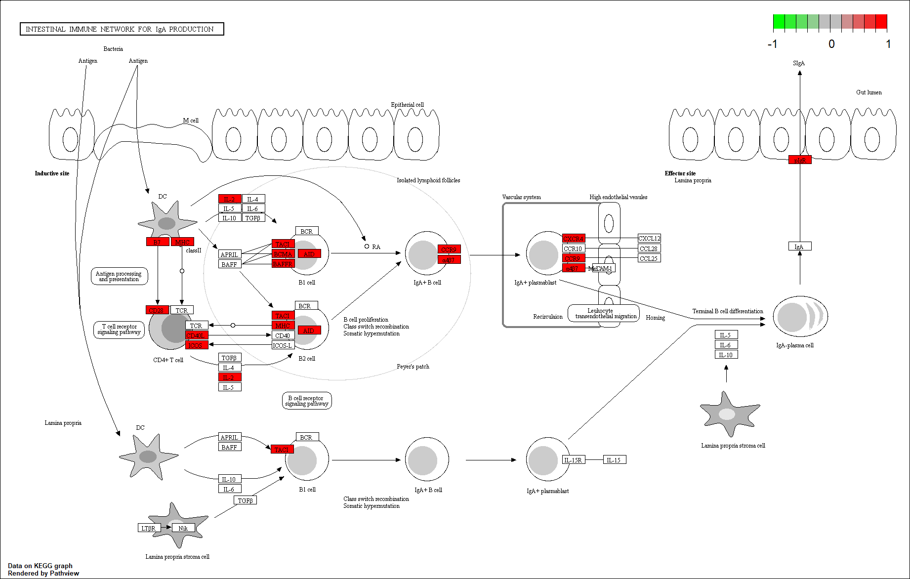

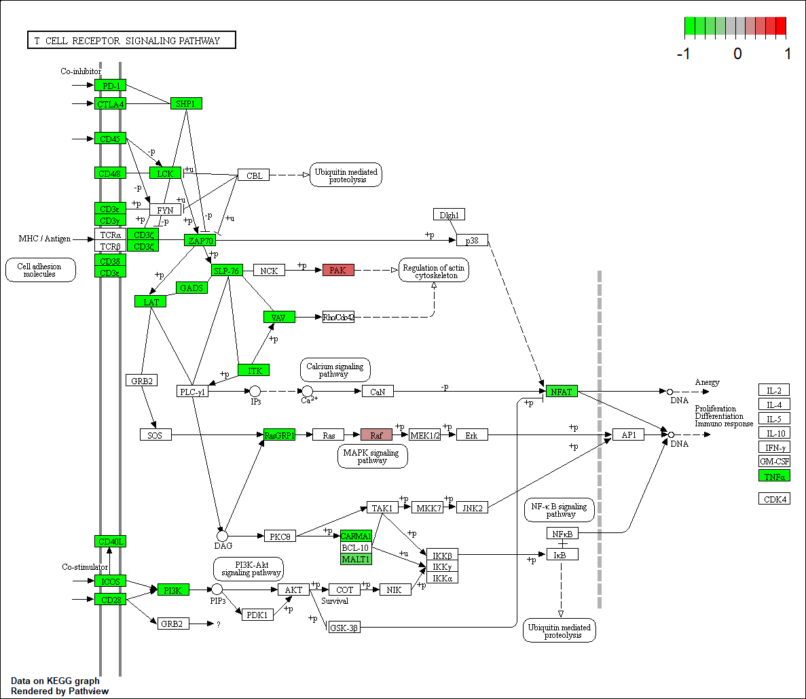

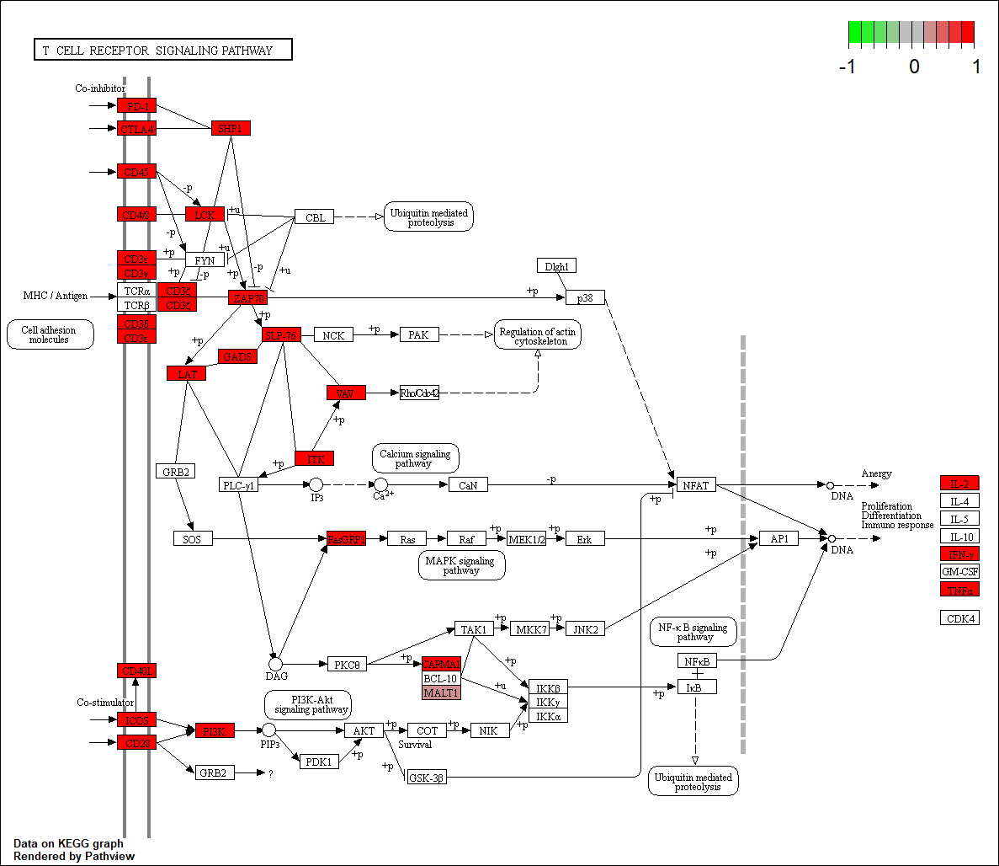

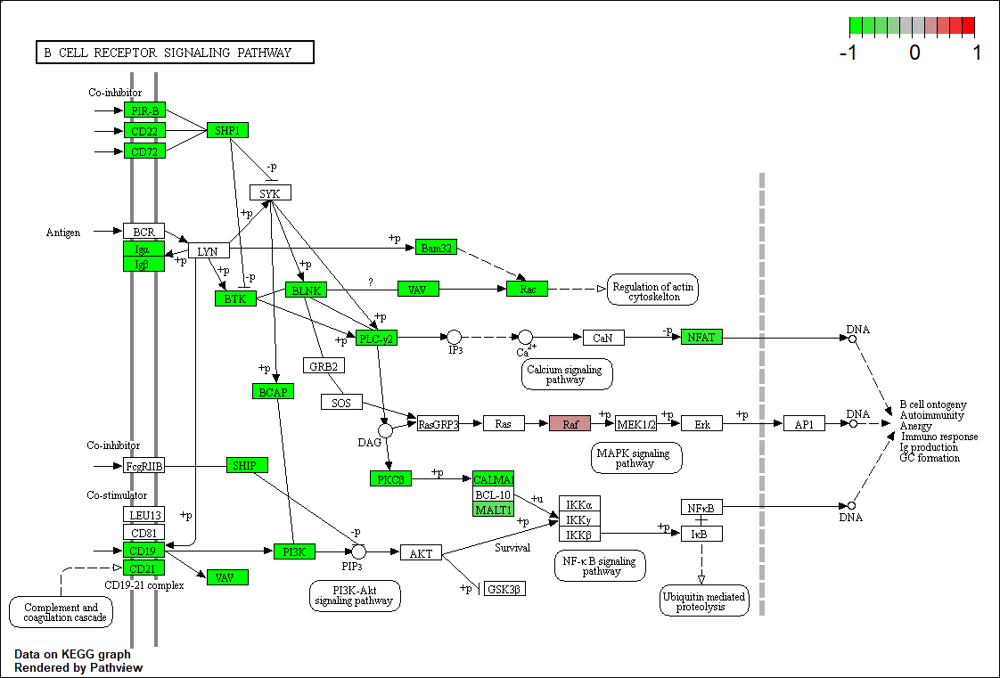

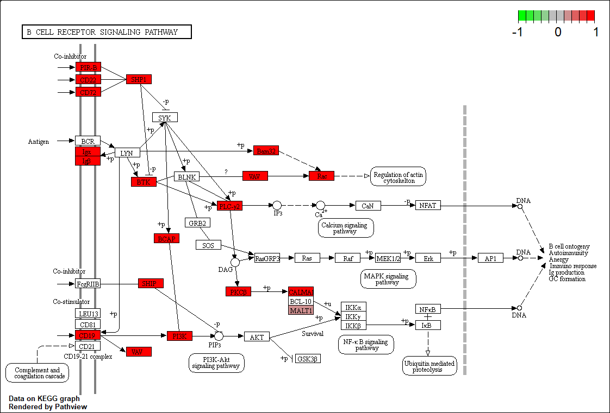

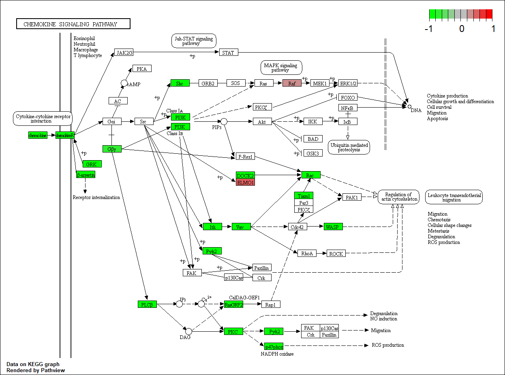

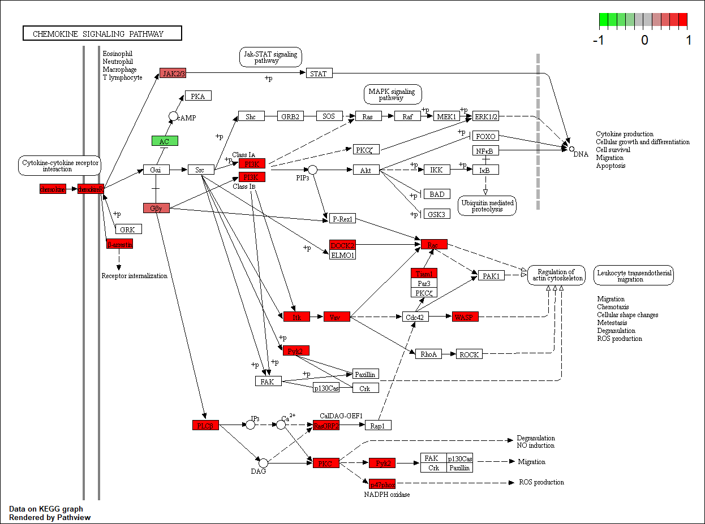

## 9. Discusión

Como se ha remarcado previamente, una de las principales limitaciones de este análisis es que la anotación de los tránscritos no ha sido del todo óptima. El hecho de que no todos los tránscritos detectados como diferencialmente expresados puedan asociarse a un gen, dificulta la interpretación de los resultados. 

Por último, cabe destacar que las muestras han sido escogidas de forma aleatoria y, aunque es poco probable, es posible que las muestras seleccionadas no sean del todo representativas y obtengamos resultados erróneos. Para asegurarnos de que los resultados que obtenemos sean concluyentes, sería conveniente realizar el análisis varias veces con distintas muestras aleatorias. 

## 10. Referencias

(1) Gonzalo, R., Sánchez-Pla, A. (2020). RNAseq pipeline - Bioconductor. (https://github.com/ASPteaching/Omics_data_analysis-Case_study_2-RNA-seq)
(2) González, I. (2014). Statistical analysis of RNA-Seq data. (file:///C:/Users/Olga/Downloads/Statistical%20analysis%20of%20RNA-seq%20data%20(1).pdf)  
(3) Love, M., Anders, S., Huber, W. (2020) Analyzing RNA-seq data with DESeq2. (http://bioconductor.org/packages/release/bioc/vignettes/DESeq2/inst/doc/DESeq2.html#differential-expression-analysis)
(4) Turner, S. (2015). Tutorial: RNA-seq differential expression & pathway analysis with Sailfish, DESeq2, GAGE, and Pathview. (https://www.r-bloggers.com/tutorial-rna-seq-differential-expression-pathway-analysis-with-sailfish-deseq2-gage-and-pathview/)